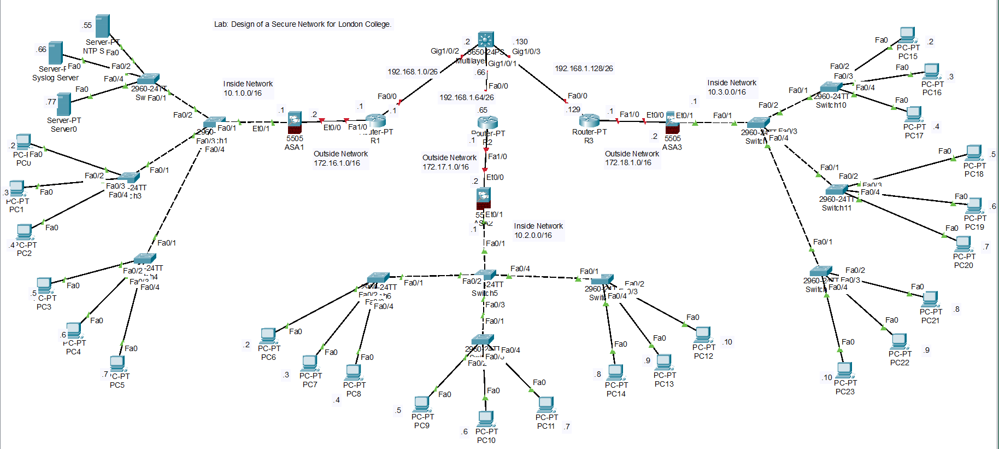

# Network Security Project

## Description
This project is part of the **Network Security** course offered by the International School of Management and Technology in partnership with the University of Sunderland. The objective is to demonstrate proficiency in designing, implementing, and testing a secure network while addressing security flaws, limitations, and future enhancements.

## Tasks Undertaken

### Scenario Analysis
- Analyzed the requirements for designing a secure network for London College.
- Documented potential security flaws, benefits, and use cases.

### Secure Network Design
- Designed a secure network topology.

- Created an IP addressing table for the network.

### Network Security Configurations
- Configured firewalls and VLANs.
- Implemented Access Control Lists (ACLs).
- Configured Secure Shell (SSH) and Telnet.
- Set up Network Time Protocol (NTP).
- Integrated Syslog and Prevention Detection Systems.
- Implemented Authentication, Authorization, and Accounting (AAA).

### Network Testing
- Developed a detailed test plan.
- Performed tests for:
  - Firewall functionality.
  - ACL effectiveness.
  - SSH and Telnet configurations.
  - NTP and Syslog configurations.
  - AAA authentication.
- Documented testing procedures, expected results, and actual outcomes.

### Recommendations
- Provided suggestions for future security enhancements and best practices for maintaining a secure network.

## Files and Documentation
- **Scenario Document**: Detailed description of the project requirements and scenario.
- **Configuration Files**: Scripts and screenshots of network security configurations.
- **Test Plans and Results**: Comprehensive documentation of the testing process and results.
- **Recommendations**: Suggestions for improving network security based on testing outcomes.

## Author
This project was completed as part of the Network Security course. For inquiries, contact sanisa00@outlook.com.

 
